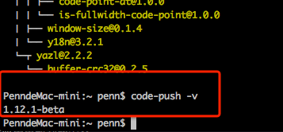
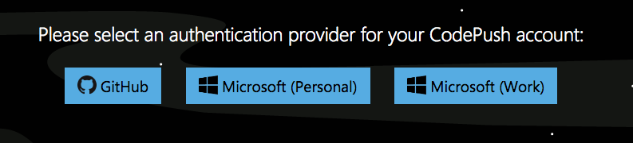
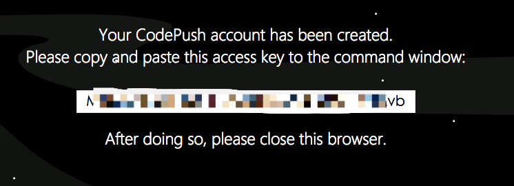
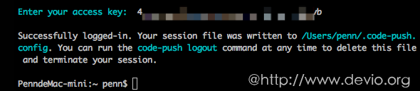
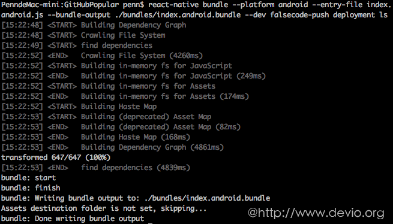
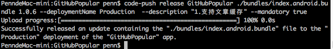
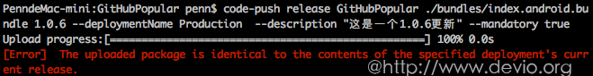
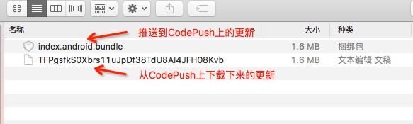
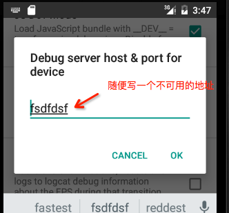

# React Native应用部署/热更新-CodePush最新集成总结


React Native的出现为移动开发领域带来了两大革命性的创新：  
1. 整合了移动端APP的开发，不仅缩短了APP的开发时间，也提高了APP的开发效率。  
2. 为移动APP动态更新提供了基础。    

本文将向大家分享React Natvie应用部署/动态更新方面的内容。    

React Native支持大家用React Native技术开发APP，并打包生成一个APP。在动态更新方面React Native只是提供了动态更新的基础，对将应用部署到哪里，如何进行动态更新并没有支持的那么完善。好在微软开发了CodePush，填补React Native 应用在动态更新方面的空白。CodePush 是微软提供的一套用于热更新 React Native 和 Cordova 应用的服务。下面将向大家分享如何使用CodePush实时更新你的应用，后期会分享不采用CodePush，如何自己去实现React Native应用热更新。  

## CodePush简介
CodePush 是微软提供的一套用于热更新 React Native 和 Cordova 应用的服务。  
CodePush 是提供给 React Native 和 Cordova 开发者直接部署移动应用更新给用户设备的云服务。CodePush 作为一个中央仓库，开发者可以推送更新 (JS, HTML, CSS and images)，应用可以从客户端 SDK 里面查询更新。CodePush 可以让应用有更多的可确定性，也可以让你直接接触用户群。在修复一些小问题和添加新特性的时候，不需要经过二进制打包，可以直接推送代码进行实时更新。    

CodePush 可以进行实时的推送代码更新：     

* 直接对用户部署代码更新  
* 管理 Alpha，Beta 和生产环境应用  
* 支持 React Native 和 Cordova  
* 支持JavaScript 文件与图片资源的更新
* 暂不支持增量更新  

CodePush开源了react-native版本，[react-native-code-push](https://github.com/Microsoft/react-native-code-push)托管在GitHub上。 

## 安装与注册CodePush    
使用CodePush之前首先要安装CodePush客户端。本文以OSX 10.11.5作为平台进行演示。    
### 安装 CodePush CLI
管理 CodePush 账号需要通过 NodeJS-based CLI。   
只需要在终端输入 `npm install -g code-push-cli`，就可以安装了。  
安装完毕后，输入 `code-push -v`查看版本，如看到版本代表成功。   
    
目前我的版本是 1.12.1-beta   

**PS.  **  
`npm`为NodeJS的包管理器，如果你没安装NodeJS请先安装。  

### 创建一个CodePush 账号
在终端输入`code-push register`，会打开如下注册页面让你选择授权账号。  
  
授权通过之后，CodePush会告诉你“access key”，复制此key到终端即可完成注册。  
  
然后终端输入`code-push login`进行登陆，登陆成功后，你的session文件将会写在 /Users/你的用户名/.code-push.config。  


** PS.相关命令**  

* `code-push login` 登陆  
* `code-push loout` 注销  
* `code-push access-key ls` 列出登陆的token  
* `code-push access-key rm <accessKye>` 删除某个 access-key  
 
### 在CodePush服务器注册app  
为了让CodePush服务器知道你的app，我们需要向它注册app： 在终端输入`code-push app add <appName>`即可完成注册。

** PS.相关命令**   

* `code-push app add` 在账号里面添加一个新的app  
* `code-push app remove` 或者 rm 在账号里移除一个app  
* `code-push app rename` 重命名一个存在app  
* `code-push app list` 或则 ls 列出账号下面的所有app  
* `code-push app transfer` 把app的所有权转移到另外一个账号  

## 集成CodePush SDK  

### Android   
下面我们通过如下步骤在Android项目中集成CodePush。  
第一步：在项目中安装react-native插件，终端进入你的项目根目录然后运行  
`npm install --save react-native-code-push`

第二步：在Anroid project中安装插件。  
CodePush提供了两种方式：RNPM 和 Manual，本次演示所使用的是RNPM。  
运行`npm i -g rnpm`，来安装RNPM。

第三步： 运行 `rnpm link react-native-code-push`。这条命令将会自动帮我们在anroid文件中添加好设置。
[react-native-code-push has been successfully linked]()  

第四步： 在 android/app/build.gradle文件里面添如下代码：
```  
apply from "react.gradle"      
apply from "../../node_modules/react-native-code-push/android/codepush.gradle"  
```
第五步: 运行 `code-push deployment ls <appName>`获取 部署秘钥。默认的部署名是 staging，所以 部署秘钥（deployment key ） 就是 staging。   
第六步： 添加配置。当APP启动时我们需要让app向CodePush咨询JS bundle的所在位置，这样CodePush就可以控制版本。更新 MainApplication.java文件：    
```java 
public class MainApplication extends Application implements ReactApplication {
  private final ReactNativeHost mReactNativeHost = new ReactNativeHost(this) {
    @Override
    protected boolean getUseDeveloperSupport() {
      return BuildConfig.DEBUG;
    }
    @Override
    protected String getJSBundleFile() {
      return CodePush.getJSBundleFile();
    }
    @Override
    protected List<ReactPackage> getPackages() {
      // 3. Instantiate an instance of the CodePush runtime and add it to the list of
      // existing packages, specifying the right deployment key. If you don't already
      // have it, you can run "code-push deployment ls <appName> -k" to retrieve your key.
      return Arrays.<ReactPackage>asList(
        new MainReactPackage(),
        new CodePush("deployment-key-here", MainApplication.this, BuildConfig.DEBUG)
      );
    }
  };
  @Override
  public ReactNativeHost getReactNativeHost() {
      return mReactNativeHost;
  }
}
```
第七步：修改versionName。  
在 android/app/build.gradle中有个 android.defaultConfig.versionName属性，我们需要把 应用版本改成 1.0.0（默认是1.0，但是codepush需要三位数）。
```
android{
    defaultConfig{
        versionName "1.0.0"
    }
}
```   
至此Code Push for Android的SDK已经集成完成。   
### iOS  
本文主要使用Android作为演示，在iOS上集成CodePush可参照：[iOS Setup](https://microsoft.github.io/code-push/docs/react-native.html#link-4)

## 使用CodePush进行热更新  

### 设置更新策略 
在使用CodePush更新你的应用之前需要，先配置一下更新控制策略，即：  

* 什么时候检查更新？（在APP启动的时候？在设置页面添加一个检查更新按钮？）
* 什么时候可以更新，如何将更新呈现给终端用户？  

最简单的方式是在根component中进行上述策略控制。  
1. 在 js中加载 CodePush模块：   
`import codePush from 'react-native-code-push'`   
2.在 `componentDidMount`中调用 `sync`方法，后台请求更新  
`codePush.sync()`   

如果可以进行更新，CodePush会在后台静默地将更新下载到本地，等待APP下一次启动的时候应用更新，以确保用户看到的是最新版本。  
如果更新是强制性的，更新文件下载好之后会立即进行更新。    
如果你期望更及时的获得更新，可以在每次APP从后台进入前台的时候去主动的检查更新：  
在应用的根component的`componentDidMount`中添加如下代码：  
```
AppState.addEventListener("change", (newState) => {
    newState === "active" && codePush.sync();
});
```
#### 生成bundle  
发布更新之前，需要先把 js打包成 bundle，以下是anroid的做法：

第一步： 在 工程目录里面新增 bundles文件：`mkdir bundles`

第二步： 运行命令打包 `react-native bundle --platform 平台 --entry-file 启动文件 --bundle-output 打包js输出文件 --assets-dest 资源输出目录 --dev 是否调试`。   
eg:    
`react-native bundle --platform android --entry-file index.android.js --bundle-output ./bundles/index.android.bundle --dev false`   



**需要注意的是：**  

* 忽略了资源输出是因为 输出资源文件后，会把bundle文件覆盖了。
* 输出的bundle文件名不叫其他，而是 index.android.bundle，是因为 在debug模式下，工程读取的bundle就是叫做 index.android.buundle。
* 平台可以选择 android 或者 ios。  

### 发布更新  
打包bundle结束后，就可以通过CodePush发布更新了。在终端输入   
`code-push release <应用名称> <Bundles所在目录> <对应的应用版本> --deploymentName： 更新环境
--description： 更新描述  --mandatory： 是否强制更新`   
eg:  
`code-push release GitHubPopular ./bundles/index.android.bundle 1.0.6 --deploymentName Production  --description "1.支持文章缓存。" --mandatory true`


**注意：**  
1. CodePush默认是更新 staging 环境的，如果是staging，则不需要填写 deploymentName。     
2. 如果有 mandatory 则Code Push会根据mandatory 是true或false来控制应用是否强制更新。默认情况下mandatory为false即不强制更新。      
3. 对应的应用版本（targetBinaryVersion）是指当前app的版本(对应build.gradle中设置的versionName "1.0.6")，也就是说此次更新的js/images对应的是app的那个版本。不要将其理解为这次js更新的版本。
如客户端版本是 1.0.6，那么我们对1.0.6的客户端更新js/images，targetBinaryVersion填的就是1.0.6。     
4. 对于对某个应用版本进行多次更新的情况，CodePush会检查每次上传的 bundle，如果在该版本下如1.0.6已经存在与这次上传完全一样的bundle(对应一个版本有两个bundle的md5完全一样)，那么CodePush会拒绝此次更新。
如图：  
    

所以如果我们要对某一个应用版本进行多次更新，只需要上传与上次不同的bundle/images即可。如：  
eg:    
对1.0.6的版本进行第一次更新：    
`code-push release GitHubPopular ./bundles/index.android.bundle 1.0.6 --deploymentName Production  --description "1.支持文章缓存。" --mandatory true`    
对1.0.6的版本进行第二次更新：     
`code-push release GitHubPopular ./bundles/index.android.bundle 1.0.6 --deploymentName Production  --description "1.新添加收藏功能。" --mandatory true`      
5. 在终端输入 `code-push deployment history <appName> Staging` 可以看到Staging版本更新的时间、描述等等属性。     
eg:  
`code-push release Equipment ./bundles 1.0.1`

下面我们启动事先安装好的应用，看有什么反应：  
  
应用启动之后，从CodePush服务器查询更新，并下载到本地，下载好之后，提示用户进行更新。这就是CodePush用于热更新的整个过程。  

对比一下推送到CodePush上的更新，与应用从CodePush下载下来的更新：  
  
由此可以发现，CodePush在更新方便并没有采用增量更新。  

**更多部署APP相关命令**

* code-push deployment add <appName> 部署  
* code-push deployment rename <appName> 重命名  
* code-push deployment rm <appName> 删除部署  
* code-push deployment ls <appName> 列出应用的部署情况  
* code-push deployment ls <appName> -k 查看部署的key  
* code-push deployment history <appName> <deploymentNmae> 查看历史版本(Production 或者 Staging)  

### 调试技巧  
如果你用模拟器进行调试CodePush，在默认情况下是无法达到调试效果的，因为在开发环境下装在模拟器上的React Native应用每次启动时都会从NodeJS服务器上获取最新的bundle，所以还没等CodePush从服务器将更新包下载下来时，APP就已经从NodeJS服务器完成了更新。
为规避这个问题可以将开发环境的调试地址改为一个不可用的地址，如下图：
  
这样APP就无法连接到NodeJS服务器了，自然也就不能从NodeJS服务器下载bundle进行更新了，它也只能乖乖的等待从CodePush服务器下载更新包进行更新了。   


## JavaScript API Reference

* allowRestart
* checkForUpdate
* disallowRestart
* getUpdateMetadata
* notifyAppReady
* restartApp
* sync

其实我们可以将这些API分为两类，一类是自动模式，一类是手动模式。  
### 自动模式
`sync`为自动模式，调用此方法CodePush会帮你完成一系列的操作。其它方法都是在手动模式下使用的。    
**codePush.sync**     
`codePush.sync(options: Object, syncStatusChangeCallback: function(syncStatus: Number), downloadProgressCallback: function(progress: DownloadProgress)): Promise<Number>;`  
通过调用该方法CodePush会帮我们自动完成检查更新，下载，安装等一系列操作。除非我们需要自定义UI表现，不然直接用这个方法就可以了。    
**sync方法，提供了如下属性以允许你定制sync方法的默认行为**  

* deploymentKey （String）： 部署key，指定你要查询更新的部署秘钥，默认情况下该值来自于Info.plist(Ios)和MianActivity.java(Android)文件，你可以通过设置该属性来动态查询不同部署key下的更新。
* installMode (codePush.InstallMode)： 安装模式，用在向CodePush推送更新时没有设置强制更新(mandatory为true)的情况下，默认codePush.InstallMode.ON_NEXT_RESTART即下一次启动的时候安装。  
* mandatoryInstallMode (codePush.InstallMode):强制更新,默认codePush.InstallMode.IMMEDIATE。
* minimumBackgroundDuration (Number):该属性用于指定app处于后台多少秒才进行重启已完成更新。默认为0。该属性只在`installMode`为`InstallMode.ON_NEXT_RESUME`情况下有效。  
* updateDialog (UpdateDialogOptions) :可选的，更新的对话框，默认是null,包含以下属性
	* appendReleaseDescription (Boolean) - 是否显示更新description，默认false
	* descriptionPrefix (String) - 更新说明的前缀。 默认是” Description: “
	* mandatoryContinueButtonLabel (String) - 强制更新的按钮文字. 默认 to “Continue”.
	* mandatoryUpdateMessage (String) - 强制更新时，更新通知. Defaults to “An update is available that must be installed.”.
	* optionalIgnoreButtonLabel (String) - 非强制更新时，取消按钮文字. Defaults to “Ignore”.
	* optionalInstallButtonLabel (String) - 非强制更新时，确认文字. Defaults to “Install”.
	* optionalUpdateMessage (String) - 非强制更新时，更新通知. Defaults to “An update is available. Would you like to install it?”.
	* title (String) - 要显示的更新通知的标题. Defaults to “Update available”.

eg:  
```javascript  
codePush.sync({
      updateDialog: {
        appendReleaseDescription: true,
        descriptionPrefix:'\n\n更新内容：\n',
        title:'更新',
        mandatoryUpdateMessage:'',
        mandatoryContinueButtonLabel:'更新',
      },
      mandatoryInstallMode:codePush.InstallMode.IMMEDIATE,
      deploymentKey: CODE_PUSH_PRODUCTION_KEY,
    });
```   


### 手动模式
**codePush.allowRestart**

`codePush.allowRestart(): void;`    
允许重新启动应用以完成更新。   
如果一个CodePush更新将要发生并且需要重启应用(e.g.设置了InstallMode.IMMEDIATE模式)，但由于调用了`disallowRestart`方法而导致APP无法通过重启来完成更新，
可以调用此方法来解除`disallowRestart`限制。  
但在如下四种情况下，CodePush将不会立即重启应用：  
1. 自上一次`disallowRestart`被调用，没有新的更新。  
2. 有更新，但`installMode`为`InstallMode.ON_NEXT_RESTART`的情况下。  
3. 有更新，但`installMode`为`InstallMode.ON_NEXT_RESUME`，并且程序一直处于前台，并没有从后台切换到前台的情况下。   
4. 自从上次`disallowRestart`被调用，没有再调用`restartApp`。

**codePush.checkForUpdate**

`codePush.checkForUpdate(deploymentKey: String = null): Promise<RemotePackage>;`  
向CodePush服务器查询是否有更新。  
该方法返回Promise，有如下两种值：  

* null 没有更新   
通常有如下情况导致RemotePackage为null:  
	1. 当前APP版本下没有部署新的更新版本。也就是说没有想CodePush服务器推送基于当前版本的有关更新。  
	2. CodePush上的更新和用户当前所安装的APP版本不匹配。也就是说CodePush服务器上有更新，但该更新对应的APP版本和用户安装的当前版本不对应。  
	3. 当前APP已将安装了最新的更新。  
	4. 部署在CodePush上可用于当前APP版本的更新被标记成了不可用。  
	5. 部署在CodePush上可用于当前APP版本的更新是"active rollout"状态，并且当前的设备不在有资格更新的百分比的设备之内。  

*  A RemotePackage instance  
有更新可供下载。    

eg：
```javascript 
codePush.checkForUpdate()
.then((update) => {
    if (!update) {
        console.log("The app is up to date!");
    } else {
        console.log("An update is available! Should we download it?");
    }
});  
```

**codePush.disallowRestart**

`codePush.disallowRestart(): void;`  
不允许立即重启用于以完成更新。    
eg:  
```javascript
class OnboardingProcess extends Component {
    ...
    
    componentWillMount() {
        // Ensure that any CodePush updates which are
        // synchronized in the background can't trigger
        // a restart while this component is mounted.
        codePush.disallowRestart();
    }

    componentWillUnmount() {
        // Reallow restarts, and optionally trigger
        // a restart if one was currently pending.
        codePush.allowRestart();
    }

    ...
}
```

**codePush.getUpdateMetadata**  
`codePush.getUpdateMetadata(updateState: UpdateState = UpdateState.RUNNING): Promise<LocalPackage>;`  
获取当前已安装更新的元数据（描述、安装时间、大小等）。  
eg:  
```javascript
// Check if there is currently a CodePush update running, and if
// so, register it with the HockeyApp SDK (https://github.com/slowpath/react-native-hockeyapp)
// so that crash reports will correctly display the JS bundle version the user was running.
codePush.getUpdateMetadata().then((update) => {
    if (update) {
        hockeyApp.addMetadata({ CodePushRelease: update.label });
    }
});

// Check to see if there is still an update pending.
codePush.getUpdateMetadata(UpdateState.PENDING).then((update) => {
    if (update) {
        // There's a pending update, do we want to force a restart?
    }
});
```  

**codePush.notifyAppReady**  
`codePush.notifyAppReady(): Promise<void>;`  
通知CodePush，一个更新安装好了。当你检查并安装更新，（比如没有使用sync方法去handle的时候），这个方法必须被调用。否则CodePush会认为update失败，并rollback当前版本，在app重启时。  
当使用`sync`方法时，不需要调用本方法，因为`sync`会自动调用。   

**codePush.restartApp**  
`codePush.restartApp(onlyIfUpdateIsPending: Boolean = false): void;`  
立即重启app。
当以下情况时，这个方式是很有用的：   
1. app 当 调用 `sync` 或 `LocalPackage.install` 方法时，指定的 `install mode `是 `ON_NEXT_RESTART` 或 `ON_NEXT_RESUME时` 。 这两种情况都是当app重启或`resume`时，更新内容才能被看到。   
2. 在特定情况下，如用户从其它页面返回到APP的首页时，这个时候调用此方法完成过更新对用户来说不是特别的明显。因为强制重启，能马上显示更新内容。  


## 总结  
上文已经介绍了CodePush在动态更新方面的一些特性，但CodePush也存在着一些缺点：  
1. 服务器在国外，在国内访问，网速不是很理想。   
2. 其升级服务器端程序并不开源的，后期微软会不会对其收费还是个未知数。  
3. 不支持增量更新。    
如果在没有更好的动态更新React Native应用的方案的情况下，并且这些问题还在你的接受范围之内的话，那么CodePush可以作为动态更新React Native应用的一种选择。  
后期会向大家分享不采用CodePush，自己搭建服务器并实现React Native应用的动态更新相关的方案。  

**参考：**   
http://microsoft.github.io/code-push/docs/getting-started.html   
https://github.com/Microsoft/react-native-code-push   

